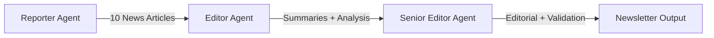

# 🚀 NVIDIA AI Newsletter

A creative and intelligent newsletter system that generates daily NVIDIA-focused AI news using CrewAI orchestration powered by OpenAI API.

## 📋 Overview

This project uses three specialized AI agents to collect, analyze, and present the latest NVIDIA technology news:

- **Reporter Agent**: Collects the 10 latest NVIDIA AI/GPU news using SerpAPI
- **Editor Agent**: Summarizes articles with strategic insights for tech leaders
- **Senior Editor Agent**: Validates content, writes editorial, analyzes trends, and provides competitive positioning

## ✨ Features

- 🤖 **CrewAI Orchestration**: Intelligent multi-agent workflow
- 📡 **Real-time News**: SerpAPI integration for latest NVIDIA updates
- 🎨 **Beautiful UI**: Streamlit-based newsletter interface
- 📊 **Strategic Analysis**: Trend analysis and competitive positioning
- 💼 **Business Focus**: Tailored for AI leaders, product managers, and tech executives
- 🔄 **Two Views**: Landing page with summaries + detailed individual article pages

## 🛠️ Tech Stack

- **Framework**: CrewAI for agent orchestration
- **LLM**: OpenAI API (GPT-4)
- **News Search**: SerpAPI for real-time NVIDIA news
- **UI**: Streamlit for web interface
- **Language**: Python 3.12+
- **Package Manager**: uv

## 📦 Installation

1. **Clone the repository**:
   ```bash
   cd newsletter2
   ```

2. **Install dependencies**:
   ```bash
   uv sync
   ```

3. **Set up environment variables**:
   ```bash
   cp .env.example .env
   # Edit .env and add your API keys
   ```

   Required API keys:
   - `OPENAI_API_KEY`: Get from [OpenAI Platform](https://platform.openai.com/api-keys)
   - `SERP_API_KEY`: Get from [SerpAPI](https://serpapi.com/manage-api-key)

## 🚀 Usage

### Option 1: Streamlit UI (Recommended)

Run the interactive web interface:

```bash
uv run streamlit run src/NewsLetter2/app.py
```

Then click "Generate New Newsletter" in the sidebar.

### Option 2: Command Line

Generate newsletter via CLI:

```bash
uv run python run_newsletter.py
```

Output will be saved to `newsletter_output.json`.

## 📖 Project Structure

```
newsletter2/
├── src/NewsLetter2/
│   ├── __init__.py          # Package initialization
│   ├── models.py            # Pydantic data models
│   ├── tools.py             # SerpAPI integration
│   ├── agents.py            # CrewAI agent definitions
│   ├── tasks.py             # Task definitions for workflow
│   ├── crew.py              # Workflow orchestration
│   └── app.py               # Streamlit UI
├── run_newsletter.py        # CLI entry point
├── .env.example             # Environment variables template
├── pyproject.toml           # Project dependencies
└── README.md               # This file
```

## 🎯 Agent Workflow



1. **Reporter** searches for NVIDIA AI/tech news using SerpAPI
2. **Editor** creates concise summaries and detailed analyses
3. **Senior Editor** validates, writes editorial, analyzes trends, compares competitors

## 📊 Newsletter Components

### Landing Page
- Front-page editorial with strategic analysis
- Grid of 10 news summaries with thumbnails
- Trend analysis and competitive positioning
- Insights for product leaders

### Individual Article Page
- Full article title and source
- Featured image
- Detailed 20-30 sentence analysis
- Link to original source

## 🎨 Customization

### Modify Search Query

Edit `src/NewsLetter2/tools.py`:

```python
def _run(self, query: str = "NVIDIA AI GPU technology news") -> list[dict[str, Any]]:
    # Customize your search query here
```

### Adjust Agent Behavior

Edit agent configurations in `src/NewsLetter2/agents.py`:

```python
agent = Agent(
    role="...",
    goal="...",  # Modify goals
    backstory="...",  # Adjust expertise
    ...
)
```

### Change LLM Model

Edit `src/NewsLetter2/crew.py`:

```python
llm_config = {
    "model": "gpt-4o-mini",  # Change to gpt-4, gpt-3.5-turbo, etc.
    "temperature": 0.7,
    ...
}
```

## 🔧 Configuration

The project follows these guidelines:

- **Python**: 3.12+ with strict type annotations
- **Code Style**: Ruff formatting and linting
- **Docstrings**: Google style
- **Max Line Length**: 100 characters
- **Max Function Complexity**: ≤ 10 cyclomatic complexity
- **Max Nesting Depth**: ≤ 2 levels

## 📝 Example Output

### Editorial Excerpt
> "NVIDIA continues to dominate the AI infrastructure landscape with its latest H200 GPU announcements and expanding partnerships with major cloud providers..."

### Article Summary
> "NVIDIA announces new enterprise AI platform aimed at simplifying deployment for product teams. This move positions them strategically against AMD's instinct series..."

## 🤝 Contributing

Contributions are welcome! Please ensure:

- Code follows project style guidelines
- All functions have type annotations and docstrings
- Tests pass (run `pytest`)
- Ruff linting passes (run `ruff check .`)

## 📄 License

Copyright (c) 2025 Shrinivas Deshpande. All rights reserved.

## 🆘 Troubleshooting

### API Key Issues
- Ensure `.env` file exists and contains valid API keys
- Check that `python-dotenv` is loading the file correctly

### Generation Takes Too Long
- Normal generation time: 2-5 minutes
- Check OpenAI API rate limits
- Verify SerpAPI quota

### Import Errors
- Run `uv sync` to ensure all dependencies are installed
- Check Python version is 3.12+

## 📞 Support

For issues or questions, please open an issue on the repository.

---

**Built with** ❤️ **using CrewAI, OpenAI, and Streamlit**